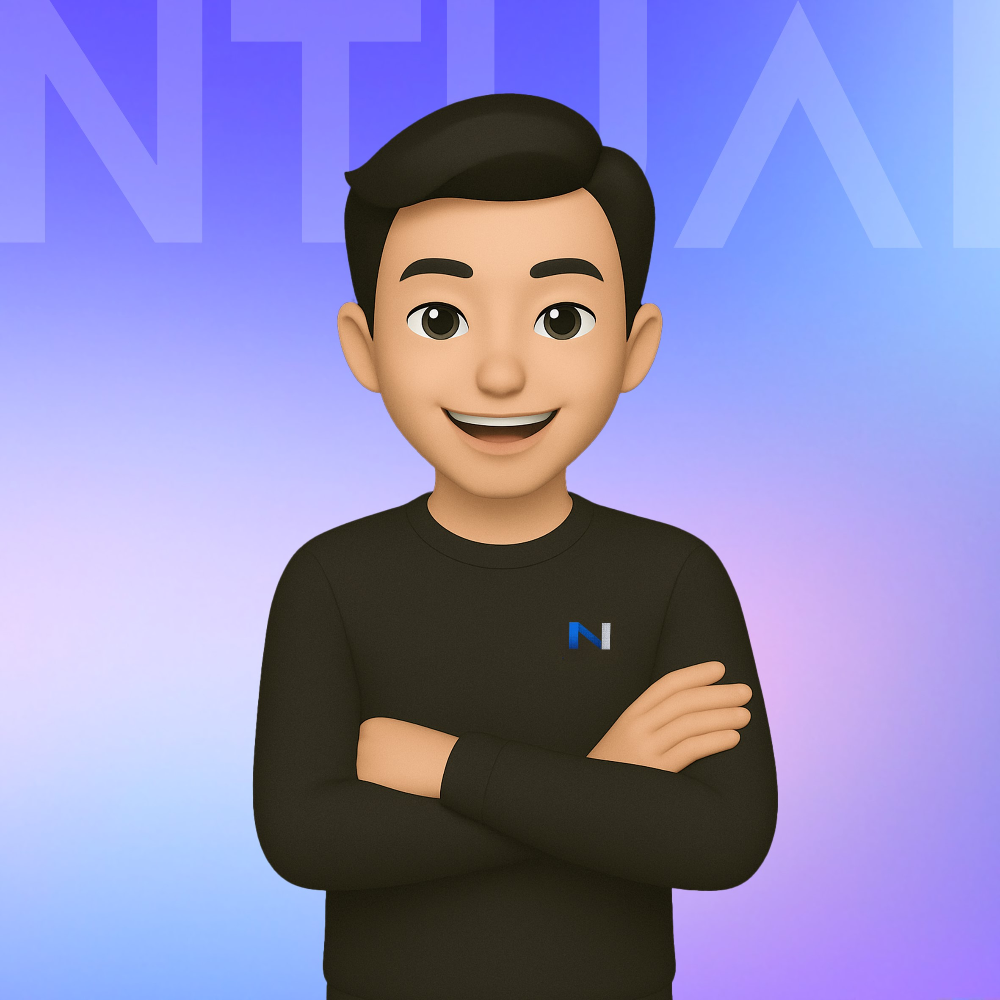

  

  <strong>Ian: Taiwan's first multi-platform AI Agent built by a student club, integrating multiple messaging platforms to provide 24/7 intelligent support.</strong>

  <a href="README.md">繁體中文</a> |
  English |
  <a href="https://www.facebook.com/ntu.ai.taiwan">Facebook</a> |
  <a href="CONTRIBUTION.md">Contributing</a> |
  <a href="ARCHITECTURE.md">Architecture</a>

## License

This project is licensed under the GNU General Public License v3.0 or later.
See [COPYING](COPYING) for the full license text.
